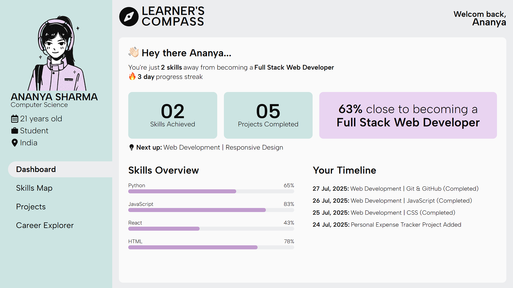
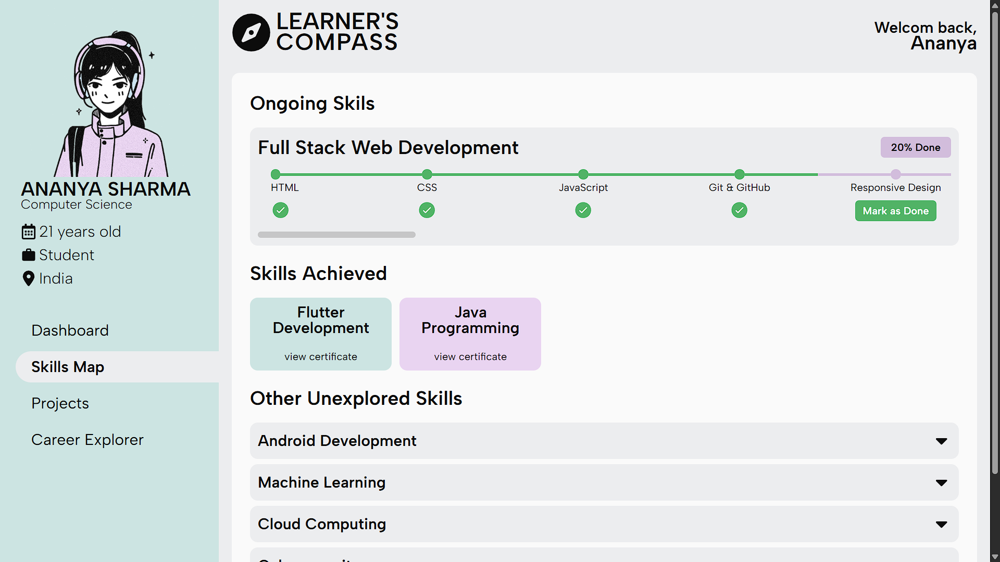
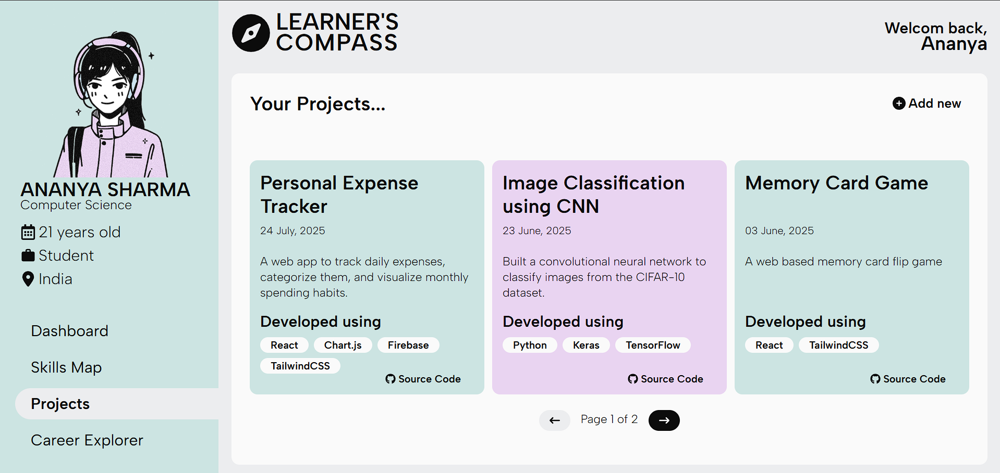

# Learner's Compass - Dashboard UI

🔗[Dashboard -Live Link](https://osmosis-round2.vercel.app)\
🖌️[Figma design link](https://www.figma.com/design/Utuq5SscVve6V6gH0wyIzn/Osmosis---Round-2-Task?node-id=15-3&p=f&t=GHVaiZFBFBeyWbUH-0)

## 📸 Project Screenshots
<p>

</p>
<p>


</p>


## 💻 Tech Stack

- React
- TailwindCSS

## 🪄 Installation

1. Clone the project from [Github](https://github.com/gaurav1-9/osmosis_round2)
```bash
git clone https://github.com/gaurav1-9/osmosis_round2
cd osmosis_round2
```
2. Install the dependencies using ```npm i```
3. Start the Development Server using the command ```npm run dev```

## 🤝 Contributing

Feel free to explore the live site and connect with me for feedback or collaboration! 😉✌️